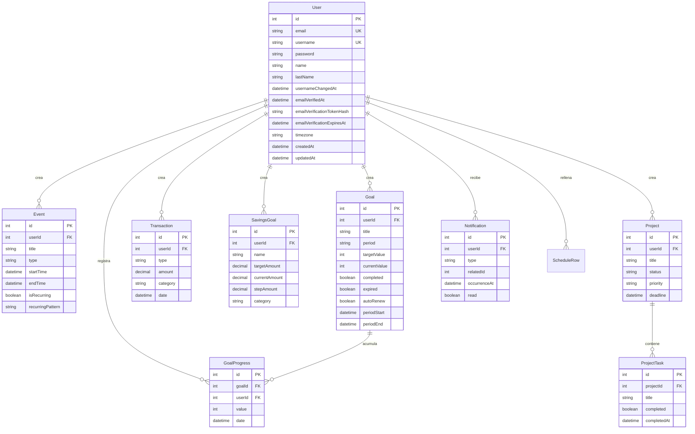

# Base de datos

PostgreSQL vía Prisma ORM. Esquema completo en [`prisma/schema.prisma`](prisma/schema.prisma).

> **Nota de precisión**: versiones anteriores de este documento (y del README) decían "7 modelos" — era un conteo incorrecto desde el primer sprint. El schema real tiene **11 modelos**: los 10 de la especificación original (`Life_Organizer_API_Especificacion.docx`, sección 4) más `Notification`, añadido para el módulo de notificaciones.

## ERD



Todas las relaciones son `onDelete: Cascade` — borrar un `User` borra en cascada todo lo suyo (eventos, metas, transacciones, etc.). No hay borrado lógico (soft delete) en ningún modelo; `DELETE` es siempre definitivo.

## Modelos

### User
Cuenta de usuario. `password` es el hash bcrypt, nunca el texto plano. `timezone` (zona IANA, default `Europe/Madrid`) determina cómo se calculan los límites de "hoy"/"esta semana" en Agenda — ver [ARCHITECTURE.md](ARCHITECTURE.md#zonas-horarias). Se puede fijar al registrarse o cambiar después vía `PUT /auth/me`.

`username` y `email` son dos alias de login independientes (ver `authService.login`: busca por cualquiera de los dos vía `OR`). `usernameChangedAt` implementa el cooldown de 15 días para cambiar el username (ver `authService.ts`); el email no tiene cooldown propio, pero cambiarlo pone `emailVerifiedAt` a `null` y genera un `emailVerificationTokenHash`/`emailVerificationExpiresAt` nuevos (hash sha256 de un token aleatorio de 32 bytes, válido 24h — ver `src/utils/verificationToken.ts`). El login no exige el email verificado, solo se usa para mostrar un aviso en el frontend. El "envío" del email de verificación (`src/utils/mailer.ts`) es por ahora solo un log con el enlace — no hay proveedor SMTP configurado.

`enabledSections`/`onboardingCompleted` alimentan el asistente de bienvenida del dashboard tras registrarse (qué apartados opcionales del menú lateral activar, más el tema de apariencia — este último vive solo en `localStorage` del frontend, no en esta tabla). `onboardingCompleted` tiene default `true` a nivel de columna a propósito (para no afectar a cuentas creadas antes de que existiera este campo); `authService.register` lo pisa a `false` explícitamente solo en el alta de una cuenta nueva, que es cuando debe verse el asistente. Se actualizan juntos vía `PUT /auth/me/onboarding`.

### Event (Agenda)
Un bloque de tiempo. `type` es texto libre validado contra una lista fija en el validador (no un enum de Prisma — mantenerlo como `String` evita una migración cada vez que se añade un tipo). Un evento recurrente (`isRecurring=true`) sigue siendo **una sola fila**: no se materializan las ocurrencias futuras, se calculan en memoria al consultar la agenda (`src/utils/recurrence.ts`). Índice compuesto `[userId, startTime]` para las consultas de día/semana.

### Goal + GoalProgress (Metas)
`Goal` es el objetivo (p.ej. "Ejercicio 5 días", `period=weekly`, `targetValue=5`); cada `GoalProgress` es un registro individual de avance que se va sumando a `Goal.currentValue`. `completed` se marca sola al alcanzar `targetValue`. `expired`/`autoRenew` (añadidos post-Sprint-5) permiten que el scheduler de `src/jobs/goalExpiryScheduler.ts` archive las metas vencidas y cree solas la del periodo siguiente — ver [ARCHITECTURE.md](ARCHITECTURE.md#schedulers-en-proceso).

### Transaction + SavingsGoal (Finanzas)
`Transaction` es un movimiento (`type: income|expense`) con `category` de texto libre. `SavingsGoal.currentAmount` **no se guarda como contador** — se recalcula en cada lectura como `Σ ingresos - Σ gastos` de las transacciones cuya `category` coincide con la de la meta de ahorro (ver `financeService.listSavingsGoals`). Así nunca se desincroniza aunque se editen/borren transacciones antiguas. `stepAmount` (default 100) es puramente de presentación — cuántas "casillas" dibuja el dashboard (`targetAmount / stepAmount`) y cuánto aporta cada clic (`POST /finance/savings-goals/:id/contribute`, que simplemente crea una `Transaction` real en esa categoría) — no participa en el cálculo de `currentAmount`.

### Project + ProjectTask (Proyectos)
Un proyecto con tareas simples (`title` + `completed`). El % de progreso (`GET /projects/:id/progress`) se calcula al vuelo contando tareas completadas — no hay columna `progress` guardada. No incluye tiempo estimado/real (mencionado en la especificación de funcionalidades pero no en su propio esquema de sección 4; no se añadió para no desviarse del schema acordado).

### Notification
Generada por dos schedulers (nunca por el usuario directamente): `event_reminder` (evento que empieza en ~30 min) y `goal_at_risk` (meta que no llegaría a tiempo). `relatedId` apunta al `Event`/`Goal` según `type`; `occurrenceAt` distingue una ocurrencia recurrente de otra de la misma serie (dos avisos de "Gimnasio semanal" en semanas distintas comparten `relatedId` pero no `occurrenceAt`). Índice `[type, relatedId, occurrenceAt]` para la deduplicación que hace el scheduler antes de crear una nueva.

## Índices

Cada modelo indexa al menos `userId` (o el FK equivalente) para que "dame lo mío" nunca sea un full table scan. Índices compuestos donde el patrón de consulta lo pide:
- `Event[userId, startTime]` — rango de fechas por usuario (día/semana).
- `Goal[periodEnd, expired]` — el scheduler de expiración escanea "todo lo vencido sin procesar" cruzando usuarios.
- `Transaction[userId, date]`, `GoalProgress[goalId, date]` — listados/analytics ordenados por fecha.
- `Notification[userId, read]` — "mis notificaciones no leídas"; `Notification[type, relatedId, occurrenceAt]` — dedup del scheduler.

## Migraciones

```bash
npm run prisma:migrate -- --name descripcion_del_cambio   # desarrollo: crea + aplica migración
npm run prisma:deploy                                      # producción: solo aplica migraciones existentes
npm run prisma:studio                                       # explorador visual de datos
```

El historial de migraciones vive en `prisma/migrations/` una vez corras `prisma:migrate` por primera vez (no está commiteado en este momento porque el proyecto no se ha ejecutado contra una base de datos real todavía — la primera vez que lo hagas, genera la migración inicial con todo el schema actual).
