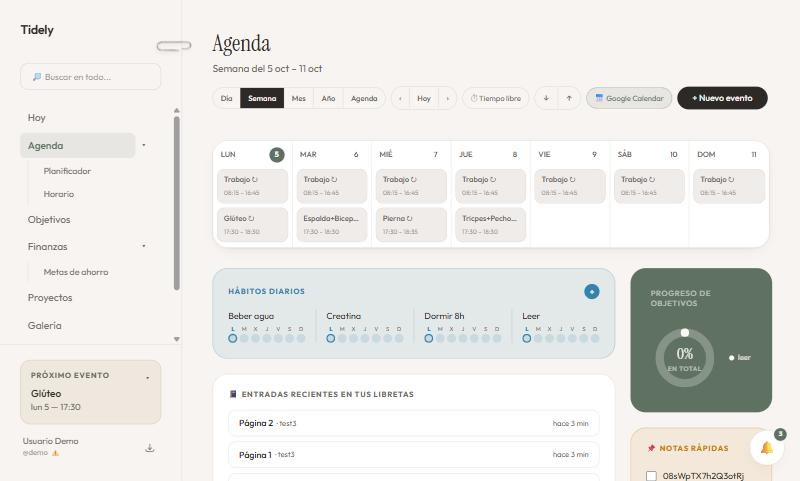

<div align="center">

# Tidely

**Organizador personal todo en uno: agenda, hábitos, metas, finanzas, proyectos y páginas propias — en la web, en escritorio y en el móvil, con sincronización offline.**

[](https://github.com/PaulaDolado/Tidely/actions/workflows/ci.yml)
[](https://github.com/PaulaDolado/Tidely/actions/workflows/deploy-pages.yml)
[](https://github.com/PaulaDolado/Tidely/releases/latest)


[**🔗 Sitio en vivo**](https://pauladolado.github.io/Tidely/) · [**⬇️ Descargar la app (APK / Windows)**](https://github.com/PaulaDolado/Tidely/releases/latest)



</div>

API REST de organización personal integral: **Agenda · Metas · Finanzas · Proyectos**, con notificaciones automáticas, eventos recurrentes de verdad y páginas personalizadas (notas, kanban, galería...). Este repo incluye la API (raíz), el [dashboard web/escritorio](dashboard/README.md) y la [app móvil](mobile/README.md).

> Estado: **Sprints 1-5 completos** + hardening post-sprint (notificaciones, recurrencia real, paginación, timezone). Los 5 módulos de negocio + notificaciones están implementados, testeados (189 tests unitarios + integración) y endurecidos.
>
> 🚀 Dashboard desplegado en GitHub Pages y API en Render; las apps de escritorio (`.msi`) y Android (`.apk`) se publican en cada [release](https://github.com/PaulaDolado/Tidely/releases/latest). Guía para desplegar tu propia instancia en [DEPLOYMENT.md](DEPLOYMENT.md).

## Documentación

| Documento | Contenido |
|---|---|
| [ARCHITECTURE.md](ARCHITECTURE.md) | Estructura de carpetas, flujo request→response, auth, schedulers, zonas horarias, decisiones de diseño |
| [API.md](API.md) | Referencia completa de endpoints por módulo (o `/api-docs` con el servidor corriendo, para Swagger interactivo) |
| [DATABASE.md](DATABASE.md) | ERD, los 11 modelos y sus relaciones, índices, migraciones |
| [TESTING.md](TESTING.md) | Cómo correr los tests, qué cubre cada carpeta, bugs reales que atraparon los tests |
| [DEPLOYMENT.md](DEPLOYMENT.md) | Guía paso a paso para desplegar en Railway o Render |
| [CONTRIBUTING.md](CONTRIBUTING.md) | Convenciones de código, checklist para añadir un módulo nuevo |
| [dashboard/README.md](dashboard/README.md) | Dashboard demo en React — cómo correrlo localmente |
| [mobile/README.md](mobile/README.md) | App móvil (Expo/React Native) offline con SQLite — Fase 1, cómo correrla localmente |

## Stack

**API** (este repo, raíz):
- Node.js 20+ / TypeScript
- Express.js
- Prisma ORM + PostgreSQL
- JWT (access + refresh) + bcrypt
- Joi (validación)
- `node-cron` (notificaciones + expiración de metas, en proceso)
- Jest + Supertest (testing)
- Swagger (OpenAPI)
- Docker + docker-compose

**[Dashboard](dashboard/README.md)** (web + escritorio):
- React 18 + TypeScript + Vite
- Tailwind CSS v4
- Tauri (instalador de escritorio `.msi`)

**[Móvil](mobile/README.md)** (Expo/React Native):
- Expo + React Native + TypeScript
- SQLite (`expo-sqlite`) offline-first con sincronización propia
- React Navigation (bottom-tabs + native-stack)

## Setup

```bash
npm install
cp .env.example .env              # ajusta los valores, sobre todo si no usas Docker
docker compose up -d db           # o tu propio Postgres, ajustando DATABASE_URL
npm run prisma:migrate -- --name init
npm run prisma:seed               # opcional: crea/recrea demo@lifeorganizer.dev / Password123 con los datos de prisma/fixtures/demoUser.json
npm run dev
```

- API: http://localhost:3000 · Health check: `/health` · Swagger: `/api-docs`

### Integración con Google Calendar (opcional)

Sin esto, la app funciona igual — esa integración simplemente responde "no configurada" hasta que la actives. Pasos en [Google Cloud Console](https://console.cloud.google.com/):

1. Crea un proyecto (o usa uno existente) y, en "APIs & Services" → "Library", habilita la **Google Calendar API**.
2. En "APIs & Services" → "OAuth consent screen", configura una pantalla de consentimiento básica (tipo "External" sirve para uso personal; añade tu propio email como usuario de prueba si el proyecto queda en modo "Testing").
3. En "APIs & Services" → "Credentials" → "Create Credentials" → "OAuth client ID", tipo **Web application**. En "Authorized redirect URIs" añade exactamente la misma URL que pongas en `GOOGLE_REDIRECT_URI` (por defecto `http://localhost:3000/integrations/google/callback`).
4. Copia el "Client ID" y "Client secret" generados a tu `.env`:
   ```bash
   GOOGLE_CLIENT_ID="tu-client-id.apps.googleusercontent.com"
   GOOGLE_CLIENT_SECRET="tu-client-secret"
   GOOGLE_REDIRECT_URI="http://localhost:3000/integrations/google/callback"
   ```
5. Reinicia el servidor. En el dashboard, botón "Conectar Google" en la cabecera de Agenda.

## Tests

```bash
npm test                 # unit + integration (requiere Postgres levantado)
npx jest tests/unit       # solo unitarios, sin BD, corren en segundos
npm run test:coverage
```

Detalle completo (qué cubre cada carpeta, bugs reales encontrados por los tests) en [TESTING.md](TESTING.md).

## Roadmap

- [x] **Sprint 1** — Setup, Auth, Agenda CRUD + tests
- [x] **Sprint 2** — Metas + Finanzas + tests
- [x] **Sprint 3** — Proyectos + Hobbies + tests
- [x] **Sprint 4** — Tests unitarios, ESLint, rate limiting, optimización de queries N+1
- [x] **Sprint 5** — CI/CD, deployment config (Railway/Render), dashboard demo en React
- [x] **Post-Sprint-5** — Notificaciones (recordatorios + alertas), eventos recurrentes reales, paginación en todos los listados, timezone del usuario aplicada en Agenda, expiración/auto-renovación de metas, documentación separada en archivos dedicados
- [x] **Rediseño del dashboard** — nueva identidad visual (paleta oklch, Tailwind v4, Outfit + Instrument Serif) adaptada de [difarmed/life-weaver-pro-23](https://github.com/difarmed/life-weaver-pro-23), con las 4 páginas (Agenda, Metas, Finanzas, Proyectos) más notificaciones — ver [dashboard/README.md](dashboard/README.md#origen-del-diseño-y-qué-se-adaptó) para qué se adoptó tal cual y qué se adaptó a nuestra API
- [x] **Sync offline + app móvil (Fase 1)** — `/sync/pull` y `/sync/push` (tombstones para borrados, last-write-wins para conflictos) cubriendo Eventos, Tareas/Subtareas, Notas y Hábitos; app Expo/React Native nueva en [mobile/](mobile/README.md) con SQLite local y una pantalla "Hoy" que funciona sin conexión — ver [API.md](API.md#sincronización-sync) para el contrato y qué módulos quedan fuera de esta fase
- [x] **Integración con Google Calendar (solo importación)** — conecta tu cuenta con OAuth2, importa eventos del calendario `primary` (± 30/180 días) y los mantiene al día con un cron cada 30 min además de un botón de "Sincronizar ahora" — ver [API.md](API.md#integraciones--google-calendar) y la sección de Setup de abajo para configurar las credenciales

## Nota de seguridad conocida (dependencias)

`npm install` reporta ~10 vulnerabilidades en subdependencias. Ninguna es explotable a través del tráfico HTTP de la API en ejecución — están en herramientas de dev (`@typescript-eslint` vía `minimatch`, ReDoS) o en la descarga del binario nativo de `bcrypt` en tiempo de instalación (`@mapbox/node-pre-gyp` vía `tar`). Arreglarlas requiere subir `@typescript-eslint` a v8 y `node-cron` a v4 (ambos breaking changes) — no los apliqué sin verificar compatibilidad primero; corre `npm audit` para ver el detalle y decide tú si quieres asumir esas actualizaciones.
